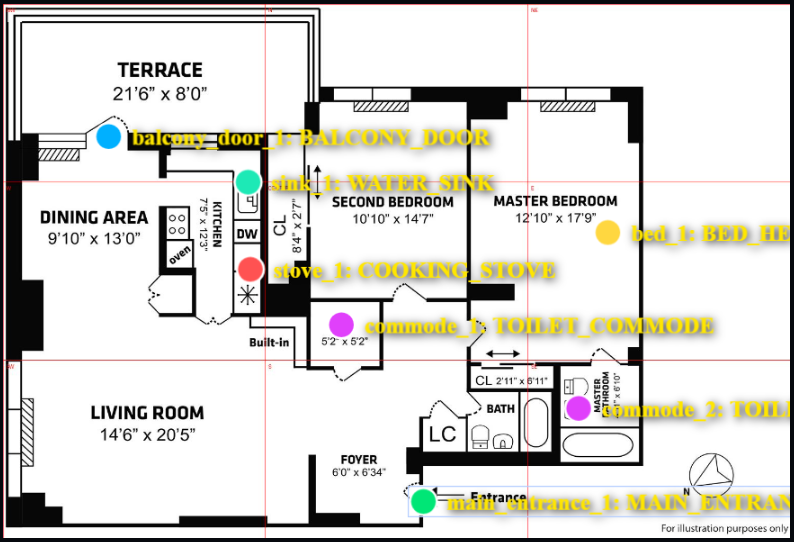

# VastuLens

**AI-powered Vastu compliance auditor for 2D floor plans.**

Upload a floor plan → AI detects fixture positions → drag markers to correct them → get a scored Vastu audit with remedies.

🔗 **[Live Demo](https://vastulens.onrender.com/)** &nbsp;|&nbsp; Built with Gemini · FastAPI · Fabric.js

---

## What it does

1. **Grid Overlay** — a 3×3 directional Vastu grid (NW → SE) is overlaid on your floor plan in memory
2. **AI Detection** — Gemini Vision reads the grid and auto-places markers for fixtures (entrance, stove, toilet, bed, etc.) with x/y coordinates
3. **Human Correction** — drag markers on the canvas or reassign labels from the sidebar if the AI misread anything
4. **Vastu Audit** — a deterministic rule engine scores each fixture's zone placement (0–100) and returns findings with remedies



---

## Why this architecture

| Layer             | Tool              | Why                                                                                                 |
| ----------------- | ----------------- | --------------------------------------------------------------------------------------------------- |
| Vision extraction | Gemini Vision API | Only practical way to locate fixtures on arbitrary floor plan images without labelled training data |
| Scoring engine    | Pure Python rules | Deterministic, zero hallucination risk — AI handles perception, rules handle evaluation             |
| Marker correction | Fabric.js canvas  | True drag-and-drop UX; keeps human in the loop for edge cases the LLM misreads                      |
| Backend           | FastAPI           | Needed to serve the interactive HTML canvas frontend and handle multipart image uploads             |

---

## Project structure

```
root/
├── main.py               # FastAPI app — /api/analyze and /api/audit endpoints
├── src/
│   ├── grid_lens.py      # Overlays 3×3 Vastu grid on floor plan image (in-memory, no disk writes)
│   ├── detector.py       # Calls Gemini Vision, returns structured marker data
│   ├── engine.py         # Deterministic Vastu rule engine, returns scored AuditResult
│   └── utilities.py      # Pydantic schemas and Gemini prompt
├── static/
│   └── index.html        # Single-page frontend — Fabric.js canvas + audit dashboard
└── samples/              # Sample floor plans for demo
```

---

## Running locally

**Prerequisites:** Python 3.11+, a Gemini API key

```bash
git clone https://github.com/yourusername/vastulens
cd vastulens
pip install -r requirements.txt
```

Create a `.env` file:

```
GEMINI_API_KEY=your_key_here
```

Start the server:

```bash
uvicorn main:app --reload
```

Open `http://localhost:8000` in your browser.

---

## API

| Endpoint       | Method | Description                                                              |
| -------------- | ------ | ------------------------------------------------------------------------ |
| `/api/analyze` | `POST` | Accepts floor plan image, returns grid image (base64) + detected markers |
| `/api/audit`   | `POST` | Accepts confirmed markers, returns Vastu score + findings                |

---

## Vastu scoring model

The engine audits 8 fixture types across 9 directional zones:

`MAIN_ENTRANCE` · `COOKING_STOVE` · `TOILET_COMMODE` · `BED_HEADBOARD` · `WATER_SINK` · `WASHING_MACHINE` · `POOJA_MANDIR` · `BALCONY_DOOR`

Each fixture is evaluated as **PASS / MINOR / MAJOR / CRITICAL** based on its zone. Penalties are summed and subtracted from 100. The Brahmasthan (center zone) is audited separately as a structural check.

> This is a first-pass screening tool based on standard 3×3 Vastu principles — not a substitute for a professional Vastu consultant.

---

## Tech stack

`Python` · `FastAPI` · `Google Gemini API` · `Pillow` · `Pydantic` · `Fabric.js` · `Bootstrap 5`
